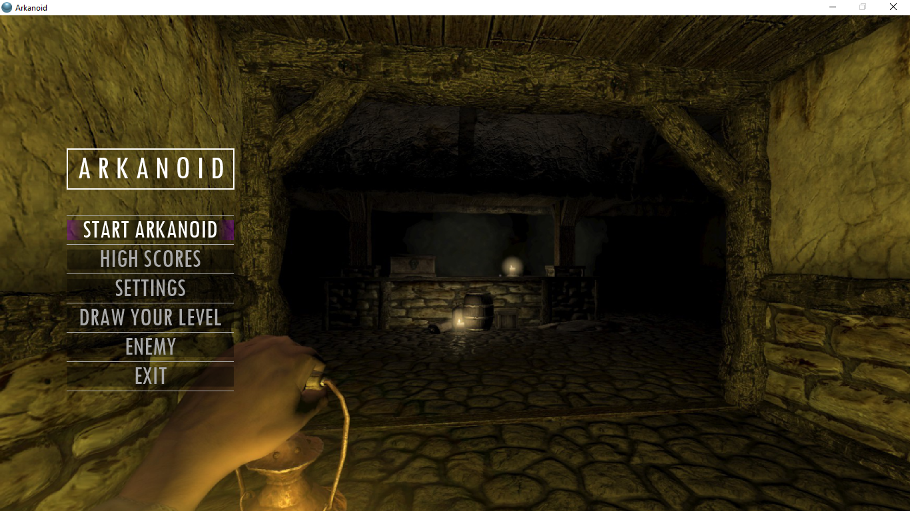
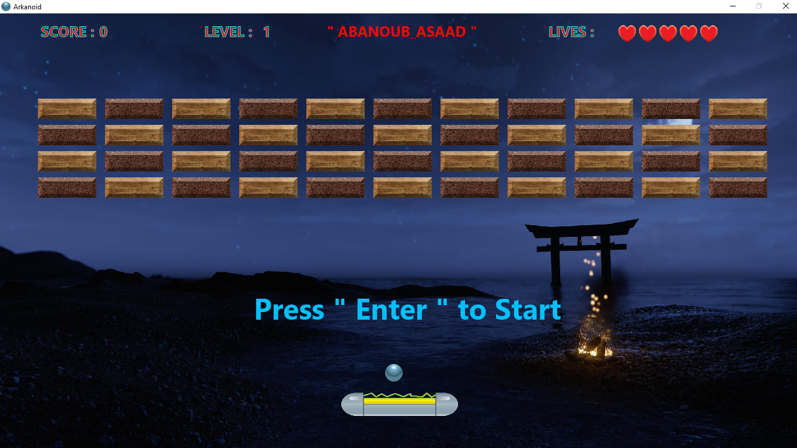
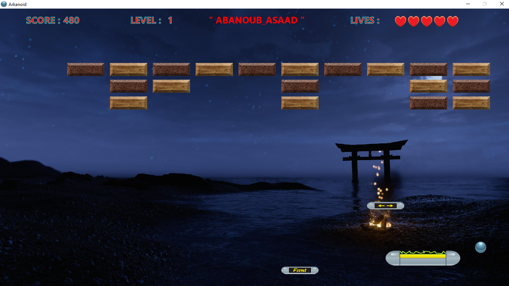
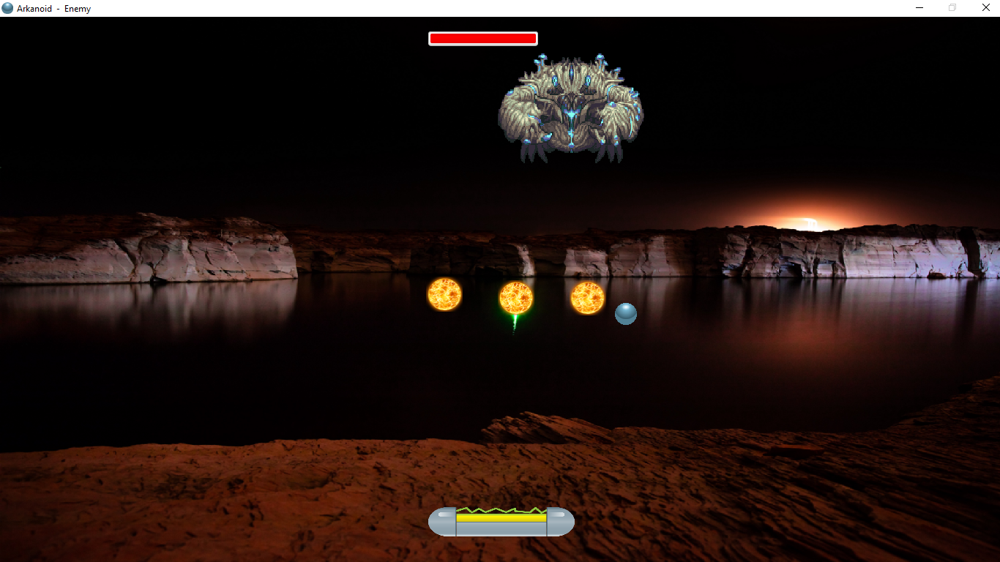
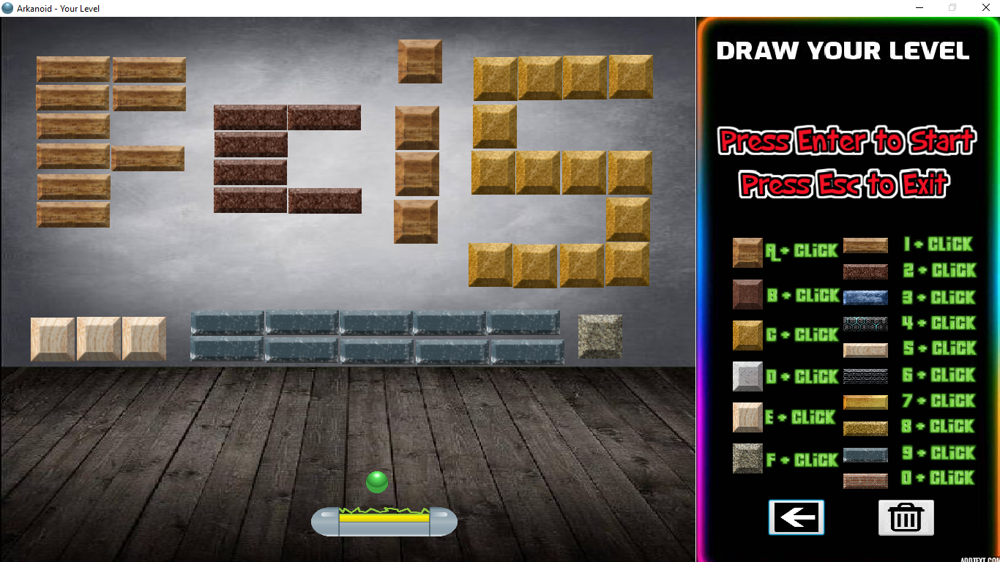
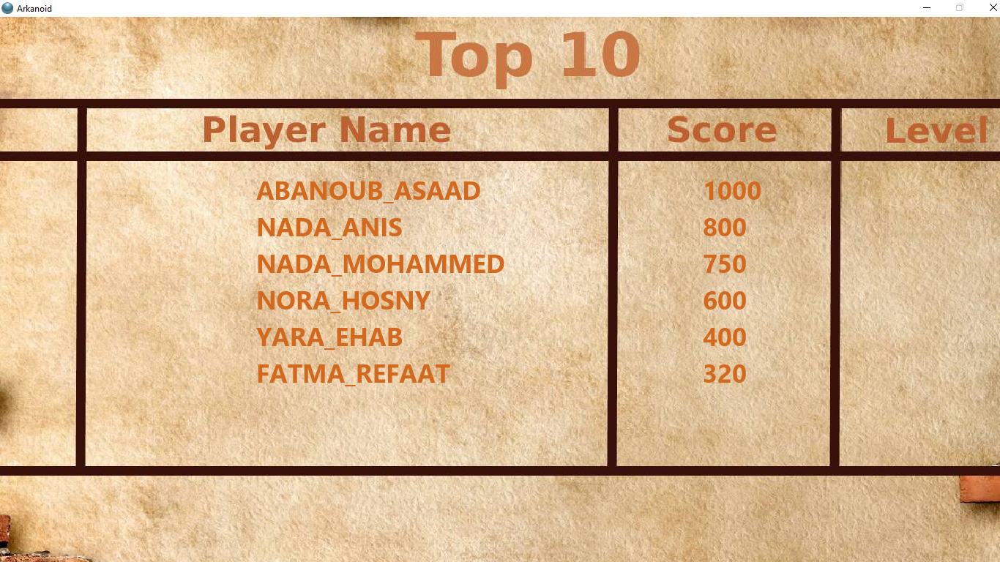

# ** Arkanoid-Game **
## Programming Languages And Tools : 
### Java & Java FX

## Description :
Arkanoid is an arcade game expanded upon Atari's Breakout games(early ball and paddle video games) of the 1970s.

- The Game is based on a specific Pattern of Bricks settled together.
- The player controls the "Vaus", a space vessel that acts as the game's "paddle" which prevents a ball .
- The ball striking a brick causes the brick to disappear.
- When all the bricks are gone, the player goes to the next level, where another pattern of bricks appears.
- ***There is A Level For The Enemy.***
- ***We added a New Option In The Game , You Can Draw Your own Level .***
- **The Player name and his Score are stored in Files .**
- Sounds For Each Level and Every touch .

## Users of the Game:
▪ Player: Characterized by Name, Score, High Score.

## Functional Requirements:
- Some bricks have to be hit multiple times before destruction (As in Level 2).
- The player's Paddle has to "catch" the Power up capsule by touching it with the paddle .
- During game play, pills/capsules fall from destroyed bricks Called Power ups. When collected, these pills have various effects on the Paddle .
- Among the many Effects the power ups provided : An increased or decreased paddle size, multiple balls, An increased or decreasedball speed and even a laser cannon attachment that allowed the player's paddle to shoot the bricks.

## Game Developers :
- **Abanoub Asaad**
- **Nada Anis**
- **Nada Mohammed**
- **Nora Hosny**
- **Yara Ehab**
- **Fatma Refaat**

# Some Screenshots for The Game : 
### Menu :
 
### Level 1 :
 
 
### Enemy :
 
### DRAW YOUR LEVEL :
 
### Scoreboard :
 
